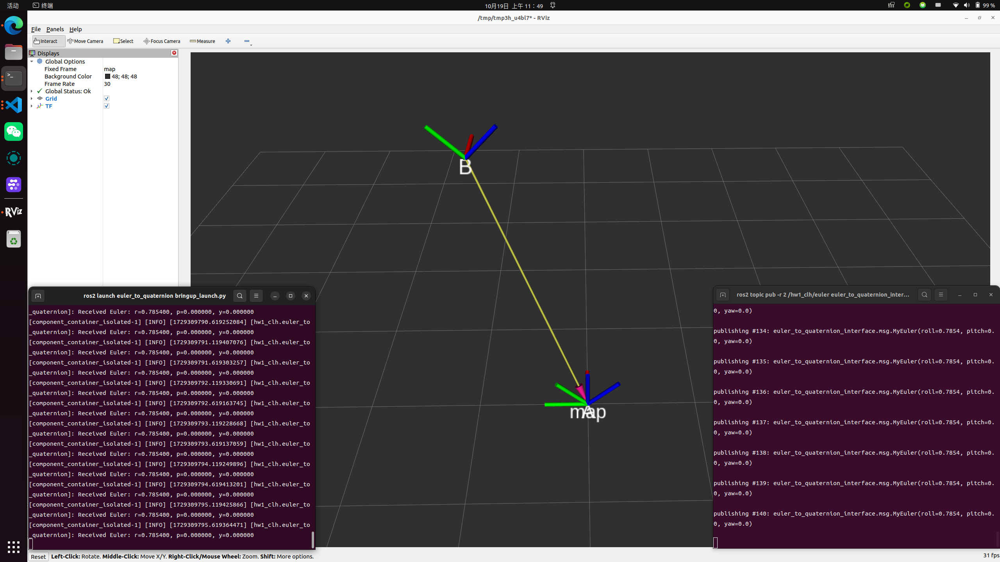

# ROS Topic: 欧拉角转四元数

## 前置知识

- 节点 Node 和软件包 Package

- 话题 Topic 和消息 Message

- 面向对象的节点 Node 实现

- ROS TF2 坐标变换

- ROS Launch 文件 (可选)

- RViz2 可视化工具的使用

## 任务概述

需要创建一个 ROS2 节点，完成以下功能：

- 创建两个自定义消息类型，一个表示欧拉角，另一个表示四元数（不使用现成的 `geometry_msgs::msg::Quaternion`）。

- 使用 C++ 类风格编程，分离头文件和源程序，编写一个节点，该节点将接收欧拉角数据，并将其转换为四元数后发布。

- 在转换后的四元数基础上，创建 `geometry_msgs::msg::Quaternion` 类型的消息，并发布两个不同的坐标变换，最后在 RViz2 中显示。

## 详细任务说明

1. **创建自定义消息功能包：欧拉角和四元数**

    - 创建一个新的 ROS2 包，包名为 `euler_to_quaternion_interface`。

    - 在包中定义两个自定义消息类型，分别表示欧拉角和四元数。消息类型的名称和结构如下：

        **欧拉角消息类型（MyEuler）：**

        ```Plain Text
        float64 roll
        float64 pitch
        float64 yaw
        ```

        **四元数消息类型（MyQuaternion）：**

        ```Plain Text
        float64 x
        float64 y
        float64 z
        float64 w
        ```

    - 注意：不要使用现成的 `geometry_msgs::msg::Quaternion`，自定义的消息类型要保存在 `msg/` 文件夹中，并在 `CMakeLists.txt` 和 `package.xml` 中正确注册。

2. **创建 ROS2 功能包和节点：欧拉角到四元数的转换**

    - 创建一个新的 ROS2 包，包名为 `euler_to_quaternion`。

    - 使用 C++ 编写一个 ROS2 节点，节点的主要任务是订阅 `/euler` 话题，并发布 `/quaternion` 话题。

    - **订阅者**：订阅类型为 `euler_to_quaternion_interface::msg::MyEuler` 的 `/euler` 话题。该话题发布欧拉角数据（roll, pitch, yaw）。

    - **发布者**：将订阅到的欧拉角数据转换为四元数，并发布类型为 `euler_to_quaternion_interface::msg::MyQuaternion` 的 `/quaternion` 话题。

    - **转换公式**：欧拉角到四元数的转换可以使用以下公式：

        ```C++
        qx = sin(roll/2) *cos(pitch/2)* cos(yaw/2) - cos(roll/2) *sin(pitch/2)* sin(yaw/2)
        qy = cos(roll/2) *sin(pitch/2)* cos(yaw/2) + sin(roll/2) *cos(pitch/2)* sin(yaw/2)
        qz = cos(roll/2) *cos(pitch/2)* sin(yaw/2) - sin(roll/2) *sin(pitch/2)* cos(yaw/2)
        qw = cos(roll/2) *cos(pitch/2)* cos(yaw/2) + sin(roll/2) *sin(pitch/2)* sin(yaw/2)
        ```

3. **实现坐标变换的发布**

    - **转换为 `geometry_msgs::msg::Quaternion` 类型**：

    在发布自定义的四元数消息 `/quaternion` 后，将其转换为 ROS 的标准消息类型 `geometry_msgs::msg::Quaternion`，用于后续的坐标变换发布。

    - **发布 map → A 坐标变换**：

    - 使用 `tf2_ros::TransformBroadcaster` 创建一个坐标变换发布器。

    - 在 ROS2 中，创建从 `map` 坐标系到 `A` 坐标系的变换，`A` 坐标系的旋转来自于上一步的四元数（`geometry_msgs::msg::Quaternion`）。

    - 不需要添加任何平移，保持 `A` 的平移为 `x=0, y=0, z=0`。

    - **发布 map → B 坐标变换**：

    - 在 `A` 坐标系的基础上，添加平移偏置 `x=1, y=1, z=2`，并创建 `map → B` 的坐标变换。

    - 该坐标变换的旋转部分依然使用上一步中的四元数。

    - **在 RViz2 中显示变换**：

    - 启动 RViz2，并添加 `TF` 显示类型。确保能够看到 `map`、`A`、`B` 坐标系。

    - 观察 `map → A` 和 `map → B` 的坐标系变换是否正确。

4. 测试：

    ```Shell
    # 2Hz发布45度的roll角
    ros2 topic pub -r 2 /hw1_clh/euler euler_to_quaternion_interface/msg/MyEuler "{roll: 0.7854, pitch: 0.0, yaw: 0.0}"

    # 2Hz发布90度的pitch角
    ros2 topic pub -r 2 /hw1_clh/euler euler_to_quaternion_interface/msg/MyEuler "{roll: 0.0, pitch: 1.5708, yaw: 0.0}"

    # 2Hz发布30度的yaw角
    ros2 topic pub -r 2 /hw1_clh/euler euler_to_quaternion_interface/msg/MyEuler "{roll: 0.0, pitch: 0.0, yaw: 0.5236}"
    ```

    
